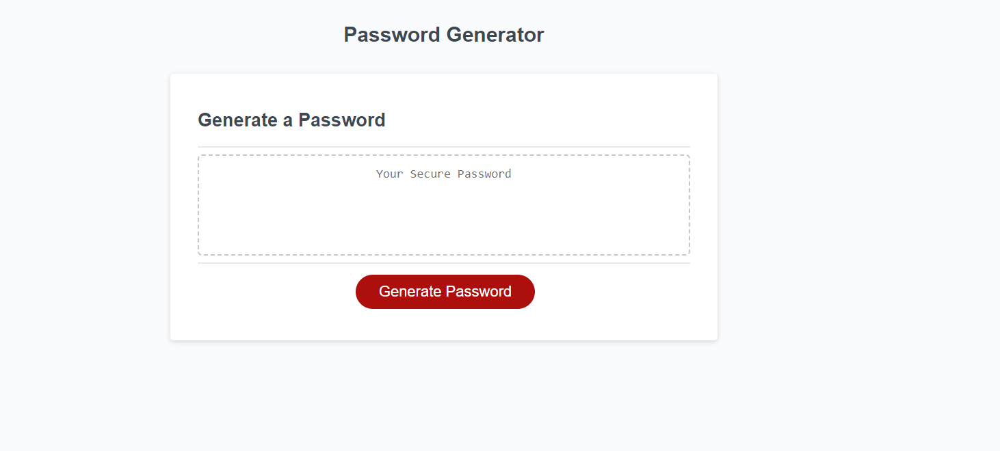

# Password Generator 🔑

## Description

[Visit The Live Site Here!!](https://nateayye.github.io/password-generator/)

A simple web app for generating a password of your chosen length and contents.

Character Options:

- Uppercase
- Lowercase
- Numbers
- Special Characters

## Installation

Clone or fork the repository from the Github repository onto your local system and then with the editor of your choosing you can run the index.html file in the root directory in your browser with your prefered extension.

## Usage

### Once on the site You will be presented with this page:

### To generate Your password you will need to press the generate password button and you will then be prompted for a length of how long you want the password to be with a minimum of 8 and max of 128 once you've selected a length that is valid you will then be asked what kind of character types you'd like in the password with a total of 4. (The types are listed above in the description).

## License

Please refer to the LICENCE file within the repositories root.
